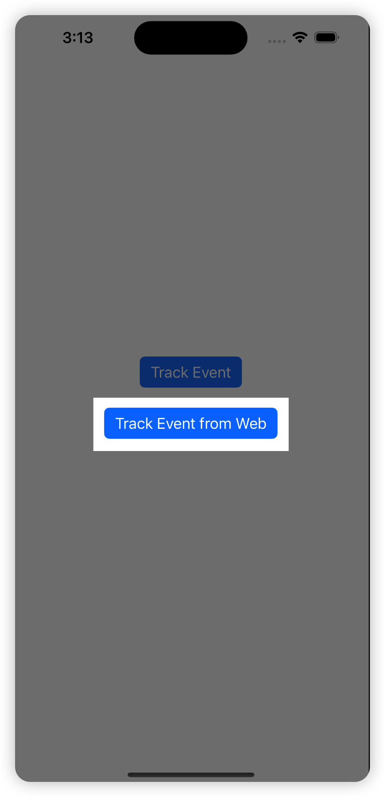

## Introduction
This document introduces best practices for integrating the Airbridge SDK using a sample app. It also provides examples of how to implement and test various methods.

# Run guide
## Prerequisites
Before installing Airbridge into your iOS app, make sure you have the following ready:

- **Xcode**: It is essential for developing iOS applications and is the primary tool for this guide.
- **CocoaPods**: It is a dependency manager for Swift and Objective-C Cocoa projects. Airbridge SDK will be installed via CocoaPods.

## How to run
### Step 1: Clone This Repository
1. Open your terminal and navigate to the directory where you want to clone the sample app. 
2. Execute the following command to clone the repository:
    ```bash
    git clone https://github.com/ab180/airbridge-ios-example
    ```

### Step 2: Install Airbridge SDK
1. Move to the directory where you've cloned the sample app repository
2. Execute the following command to install the necessary dependencies:
    ```bash
    pod install
    ```

> **Note**
> This app's Podfile already includes the Airbridge SDK, so basically  there's no need to add it. 


### Step 3(Optional): Open `airbridge-ios-example.xcworkspace`
If you've successfully completed **Step 2**, the project will be launched automatically. 

However, if it fails to run due to some error, or you want to skip the **Step 2**, you can open `airbridge-ios-example.xcworkspace` file to access the project.


### Step 4: Build and Run the App 
1. Press the **Run** button to initiate the build process and launch the application in the simulator or a connected device.
2. Make sure the app configured correctly.

     If the build process completes successfully you should see a screen with two buttons, `Track Event` & `Track Event From Web`, on your simulator or device.


> **Warning**
> Make sure you're working on right branch. 
> 
> By default, the project operates based on the main branch, unless there are specific instructions to use another.

# Test guide
> **Note**
> If you haven't downloaded the project or can't run the app, see the **How to run** part first.

## In-App Event
Utilizing this sample application, you're able to test the transmission of in-app events within a native environment.

Additionally, you can monitor the outcome of these events through the Airbridge dashboard.

### Step 1: Press the `Track Event` Button
1. Press the `Track Event` button in the application

    Upon doing this, a pre-configured in-app event from the sample app will be transmitted to the Airbridge server. 
2. Check the alert message 

    If the event was successfully transmitted to the Airbridge server, you will see an alert message indicating a successful send operation. 

<p align="center">


</p>

### Step 2: Check App Real-time Logs
1. Look for the `Product View` event in the **App Real-time Logs**. 

    If the event was successfully transmitted, relevant details about it will appear here. Please note, processing and displaying these events can take a few minutes, so a slight delay is expected.


> **Note**
> See [this guide](https://help.airbridge.io/hc/ko/articles/900001040046?utm_source=Browsing) for how to approach and use the App Real-time Logs.

> **Note**
> If you couldn't find the event, go through the **How to run** of this guide again to make sure everything is configured properly.


## Hybrid Web Event
Utilizing this sample application, you're able to test the transmission of in-app events within a web view environment.

Additionally, you can monitor the outcome of these events through the Airbridge dashboard. 

### Step 1: Press the `Track Event from Web` Button
1. Press the Track Event from Web button in the application

    After that, you will see the web page with the `Track Event` button. 
2. Press the Track Event button in the web view

    It will send a pre-configured event for tracking purposes.


<p align="center">
    
    
</p>

### Step 2: Check App Real-time Logs
1. Look for the `example-event` event in the **App Real-time Logs**. 

    If the event was successfully transmitted, relevant details about it will appear here. Please note, processing and displaying these events can take a few minutes, so a slight delay is expected.


> **Note**
> See [this guide](https://help.airbridge.io/hc/ko/articles/900001040046?utm_source=Browsing) for how to approach and use the App Real-time Logs.

> **Note**
> If you couldn't find the event, go through the **How to run** of this guide again to make sure everything is configured properly.

## Deeplink event
This sample application is already equipped with the necessary logic to process deep links.

By testing it, you can explore how the application responds upon clicking a deep link. This also includes a guide on how to monitor the triggering of the deep link open event via the Airbridge dashboard.

### Step 1: Click a deeplink from web browser
1. Activate a deep link by clicking on it from within your web browser. 

    This action should automatically trigger the associated app to open. If the app successfully processes the received deep link, an alert window will appear, displaying the URL of the deep link that was activated.


<p align="center">
    
    
</p>

> **Note**
> This project provides some ready-to-use deep links:
> 1. [Store fallback link](https://abr.ge/@exabr/kakao?click_id={click_id}&gaid_raw={google_aid}&ifa_raw={apple_ifa}&routing_short_id=fedsn&sub1={ad_service_id}&sub2={mbrseq}&sub_id={placement_id}&tracking_template_id=305dcdfdf9ffa3f73fe049001dc3d365&ad_type=click)
> 2. [Web fallback link](https://abr.ge/@exabr/kakao?click_id={click_id}&gaid_raw={google_aid}&ifa_raw={apple_ifa}&routing_short_id=kya2q&sub1={ad_service_id}&sub2={mbrseq}&sub_id={placement_id}&tracking_template_id=126a4d3d7bf226be82eeee61cdf9196a&ad_type=click) (leads to sample web page if fails)
> 3. `Open deeplink` button in [sample web page](https://ab180.github.io/airbridge-web-example/?app=exabr) (introduced in the above screen shot)
> 4. Any URL having `exabr` scheme(ex. `exabr://example`)

### Step 2: Check App Real-time Logs
1. Look for the `Deeplink Open` event in the **App Real-time Logs** in the app's dashboard. If the event was successfully transmitted, relevant details about it will appear here. 

    Please note, processing and displaying these events can take a few minutes, so a slight delay is expected.


> **Note**
> See [this guide](https://help.airbridge.io/hc/ko/articles/900001040046?utm_source=Browsing) for how to approach and use the App Real-time Logs.